# CSE2010 Computer Science 2 Notes
## Table of Contents
[Trends in Computing Science](#trends-in-computing-science)
* [A Brief History of Computer Science](#a-brief-history-of-computer-science)
* [Trends in Modern Computer Technology](#trends-in-modern-computer-technology)

## Trends in Computing Science
__Computing Science__ is the study of algorithms, including but not limited to, the following: 
1. Their formal and mathematical properties. These properties are constantly referred to as **computer logic**. 
2. Their hardware applications such as computes and everything that uses computer components. 
3. The linguistic realization. More commonly, their *computer programming language*. 
4. Their applications 

An **algorithm** is a well-ordered collection of unambiguous and effectively computable operations that, when executed, produces a result and halts in a finite amount of time.

NOTE: None of these definitions rely on modern technology

## A Brief History of Computer Science

* Before recorded time - Stonehenge is thought to be a calendar or astrological calculator.

  
* 1700s - French mathematician *Blaise Pascal* and later, German mathematician, *Gottfried Wilhelm von Leibniz* invented mathematical machines that could perform basic arithmetic. 
* 1843 - *Augusta Ada King, Countess of Lovelace* improves upon *Charle's Babbages's* **Analytical Engine** by inventing the algorithm loop. 
  
* 1936 - *Alan M. Turing* Developed the **Turing Machine**, which led to the development of *Colossus*, considered by many to be the first all-programmable electronic digital computer. \
* 1946 - The ENIAC computer is unveiled. John von Neumann was a consultant on the project. The ENIAC is credited as the first modern computer. 
  * 
    * By the end of its operation in 1956, ENIAC contained 20,000 vacuum tubes; 7200 crystal diodes; 1500 relays; 70000 resistors; 10000 capacitors and approximately 5 million hand-soldered joints. It weighed more than 30 short tons (27 tons) and filled a medium-sized room. 
* 1951 - The UNIVAC is the first commercial computer, which the U.S. government used in their census department. 
  * 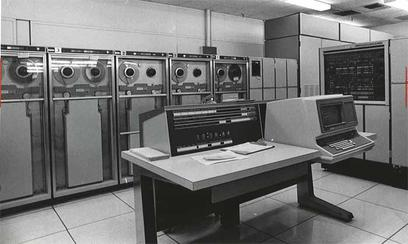
    * UNIVAC used first generation software, where the programming language was similar to binary and programmers would program by arranging sets of 0s and 1s that represented statements. 
* 1960s - Introduction of languages such as FORTRAN and COBOL, which were *high-level languages*, meaning they were written with more human-like language rather than binary (low-level language).
* 1970s - Introduction of the *operating system* and *structured programming languages*. 
* late 1980s - Introduction to parallel computing architecture (multi-core processing). Doubled and/or tripled the processing capabilities of computers at that time. 
* late 1980s - Introduction of the *Ethernet Cable*, which significantly reduced the cost of networking, paving the way for the internet. 
* 1990s - introduction of modular programs within the operating system. (MS Office, paing, other installables like games, etc.).
* 1990s - Introduction of Object-oriented programming. 

### Trends in Modern Computer Technology
* Social Media
* eCommerce
* eSports
* Second life and other simulators
* Virtual Reality and Augmented Reality
* Artificial Intelligence and Machine Learning
* Big Data
* Cloud Computing
* Internet of Things (IoT), Smart Things
* CyberSecurity
* Quantum Computing

## New System Design
* A __societal issue__, where a problem or its solution has considerable influence on individuals within a society. Current example is Artificial Intelligence affecting the job market, individual efficiencies through automation, youth education, media, visual arts, and more. 
* An __ethical issue__ is a problem or situation that requires a person or organization to choose between alternatives that may be evaluated as *right* or *wrong*. 
* For IB, it is important to discuss how new computer systems help or hinder an issue. The scope can be as large as the human population or as small as an individual. 
### Stakeholders
To understand what issues may arise, relevant stakeholders must be identified and consulted. 

* A *stakeholder* is a person, group, organization, or entity that has **interest** or **concern** in an organization.
* Example: the stakeholders involved in the success of your education include, 
  * You, the student
  * teachers that teach the student
  * the parents that raise the students
  * the principal and other admin that ensure operations within the school and individual student completion. 
  * Secondary Stakeholders:
    * The school district/division
    * city transportation
    * utilities company (electricity, water, internet)
    * provincial government 
* Not all stakeholders are **equal**. Oftentimes, stakeholders are categorized as internal (primary) or external (secondary) to the entity. 
* To identify internal stakeholders affected by a new system, ask the following, 
  1. Who will be **affected by** the new system? (teachers)
  2. Who will the new system **affect**? (students)
  3. Who will the **end-users** be?
  4. What are the new system's **needs**?
* Internal stakeholders tend to be directly connected to the old/new system. 
* Social Studies links 
  * Multiple influences outside the system can affect how a new system is developed. 
  * When designing a new system, *not every stakeholder will receive a desirable outcome*.
  * *Utilitarianism* is the approach where new systems results in the greatest good for the greatest number of people. Computer systems can inadvertently amplify these prejudices. 

### Real World Scenarios (IB)
When designing a new system for a client, input from all relevant stakeholders is needed to ensure the system meets the client's needs. This process is called a *scope analysis*. 
*Some examples of methods in obtaining requirements include, 
  * Surveys
  * Interviews
  * Direct Observation
  * Collecting Documents

#### Surveys
Involves paper and/or online questionnaires for stakeholders to complete. 
* Advantages
  * Simple in administering and analyzing
  * Easy to access
  * Easy to get specific information
  * Inexpensive
  * Can be confidential
  * Large amount of data in a short amount of time
  * Flexible time frame to answer the survey
* Disadvantages
  * Inflexible - questions are set
  * Hard to regulate answer integrity
  * Recipient bias
  * Difficult to ask the "right questions"
  * Question design bias

#### Interviews
Involves interviewing key people within the system to find out information for the new system. 
* Advantages
  * More detailed responses
  * Individualized responses
* Disadvantages
  * Interviewee bias (who is available, smaller data set, ...)
  * Interviewer bias (how questions are asked, ...)
  * Time Consuming
  * Additional operational complexities
  * More/Most expensive
  * Smaller dataset
  * Difficult to find patterns in the responses

#### Direct Observation
Involves walking throughout the system so that the designers can observe the current system first hand. 
*Advantages
  * Can produce authentic results
  * No interview bias (no people)
  * Self-paced
  * Less disruptive
  * Effective for highly structured systems
*Disadvantages
  * The Hawthorne effect (with people)
  * Lack of communication with workers

#### Collecting Documents
Involves looking in the documents currently being used in the system to understand how the system functions.
* Advantages
  * Provide a thorough record of the system process
  * Minimal disruption to the system
  * Process data at an individual pace
  * Multiple outcomes to collecting documents
  * Some inefficiencies are easier to identify
* Disadvantages
  * Difficult to sift through the number of documents
  * Documents primarily demonstrate completed processes
  * Documents can be mishandled

* For IB, it is important to compare and contrast the advantages and disadvantages of these methods of collecting data. 
* When selecting advantages and disadvantages, ensure that they are unique to the method of collecting data.

### Steps in designing a new system
determine relevant stakeholders :arrow_right: obtain requirements :arrow_right: **gather and consolidate information** :arrow_right: start designing/building a new system. 

* Before you start programming a new system, knowing exactly what the *final product* should prevent/mitigate *scope creep*.        

Additional forms of gathering information includes:
* Examining the current system
* Looking at competing products (and IP (intellectual property))
* Organizational capabilities 
* Literature searches (web/books) 

### Back to Ethics, Ergonomics, Usability and Real World Scenarios
#### Example Scenario
Societal Issue: Those who have physical or mental development challenges are unable to interact with other populations in common tasks because of limited cognition, mobility, and/or motor controls.
Ethic Issue: Is it right to exclude certain populations form participating in recreational activities if they are unable to use or manipulate the controls? 

[Microsoft Adaptive Gaming Controller](https://youtu.be/9fcK19CAjWM)

[XBox Adaptive Controller](https://xbox.com/en-CA/accessories/controllers/xbox-adaptive-controller)

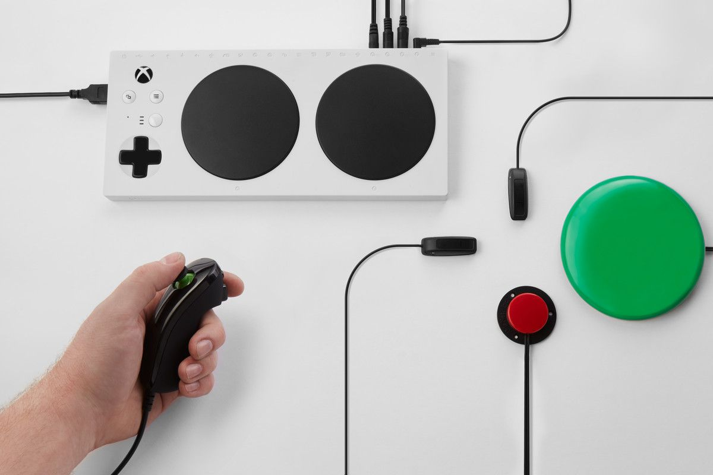

#### Terms 
* **Usability**, which refers to the potential of a product, application or website to accomplish user goals. Eight qualities of usability include, *complexity/simplicity, effectiveness, efficiency, error, learnability, memorability, readability/comprehensiveness, and satisfactions*.
* 5 japanese gadgets tested by designed expert
* identify a range of usability problems with PCs, digital cameras, cell phones, game consoles, and MP3 players
* **Accessibility** refers to the design of products, devices, services or environments for people with disabilities or special needs.
* **Ergonomics** is the scientific discipline concerned with understanding how the human body interacts with elements of a system.
  * How well the form fits the function

#### Additional topics for discussion
* Robotics replacing humans in the work force
* AI algorithms scheduling workers through Just-In-Time scheduling
* Mobile applications being addictive/frustrating/less efficient
* Cybernetic implants into the human body
* Rat race between software and hardware development

## System Design Illustrations
Many illustrations represent how systems function: 
1. System flow chart
   * represents the process of the program It uses arrows from one shape to another.
   * IB System flowcharts only use decision and process shapes. 
  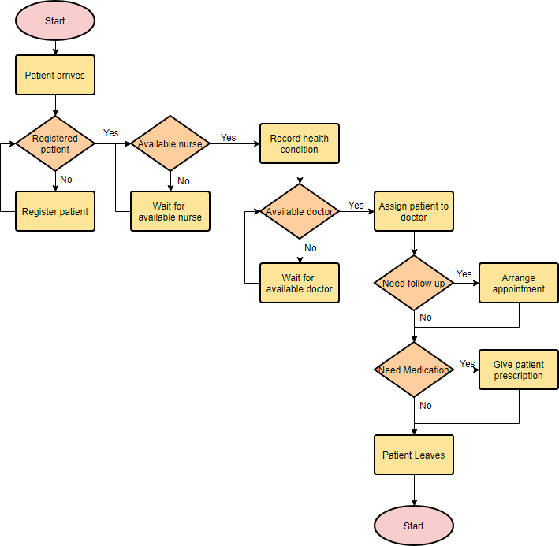

2. Data flow diagram
  * Maps the flow of information within the process or system.
  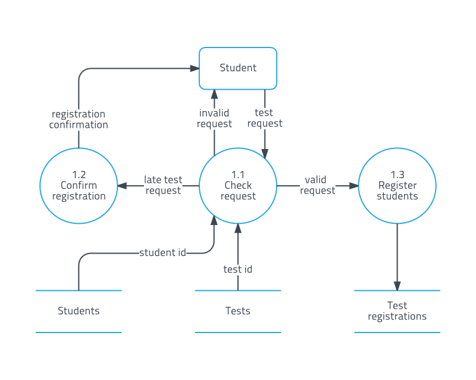

3. Structure Chart 
   * represents the organization of a system, usually in a hierarchial order. 
   * Oftentimes, this chart is called an organization structure chart.
   
   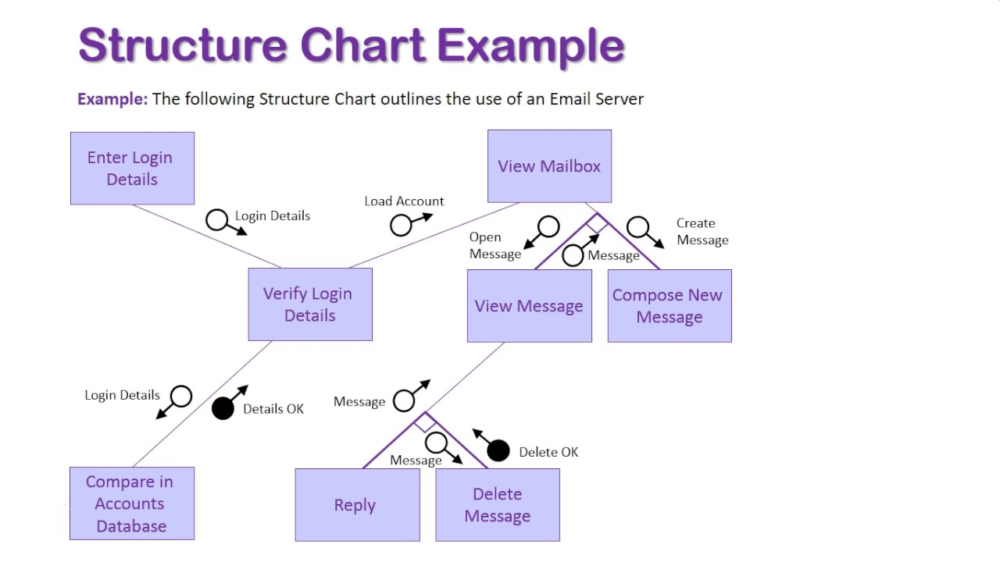
   * Another type of structure chart is a Warnier/Orr diagram, which starts at the outputs and works backwards through the sub-programs. (only AB)
   
   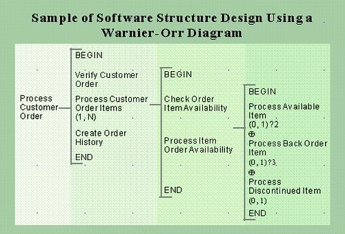
4. UML Tables !important
   * represents class templates in object-oriented programming, table structure in databases, and are entities in entity relationship diagrams.
   
   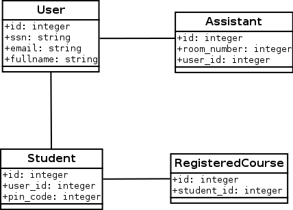
5. Entity Relationship Diagram !important
   * represents how entities in different tables connect to entities in other tables.
   * This diagram relates closely to **one-to-one**, **one-to-many**, and **many-to-many** data relations in databases. 
6. Gantt Charts 
   * visual representation of the progress of individual tasks within a project in relation to the time required to complete each task. 

*NOTE*: When designing systems, several illustration tools are needed to describe the system. 

*Note*: There are many stakeholders involved in the development of a new project. Each have a different perspective of what the final product looks like. 

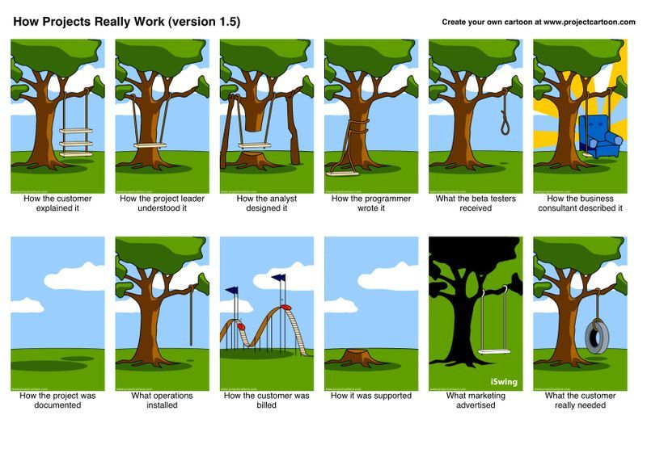

[3 Mistakes New Programmers Make](https://www.youtube.com/watch?v=8mdxrScW3jQ)

### Entity Relationship Diagrams (ERD Diagrams)
Entity relationship diagrams (ERD) are used to describe how rows of data in one table of a database interacts with the rows in another table of the database. If we have two tables, TABLE A and TABLE B, a **one-to-one** relationship is where one row in Table A will join with exactly one row in Table B; a **one-to-many** relationship is where one row in Table A will join with multiple rows in table B; and a **many-to-many** relationship is where multiple rows in Table A will join with multiple rows in Table B. Furthermore, there are optional connections, where a row may join with zero rows in the joining table. 

For IB notation, entities are described with rectangles and relationships are described with rhombuses. The relationship lines use crow's feet notation. 

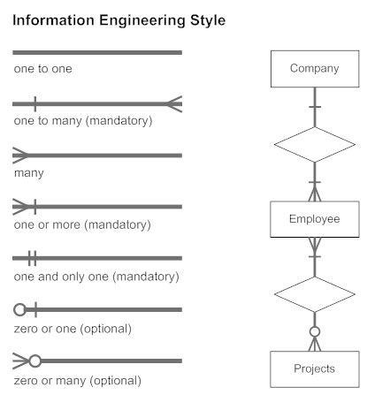

## Sub-programs 
A subprogram is a sequence of instructions whose execution is invoked from one or more remote locations in a program, with the expectation that when the subprogram execution is complete, execution resumes at that main program. In high-level languages (python, Java, Javascript), subprograms are also called subroutines, procedures, functions, and libraries (CS20). In object-oriented languages, they are usually called methods or sub-classes (CS30). In most modern high-level languages, subprograms can have parameters, local variables, and returned values. 

NOTE: APIs (Application Programming Interfaces) are considered a subprogram. 

### Within a single language program
Single program modules are programs that contain sub-programs within the same programming language. Sub-programs are often self-sufficient (which means they can run without the rest of the program) and divide the main program into separate categorized sections. By dividing a large program into sub-programs, concurrent development of the source code is possible.

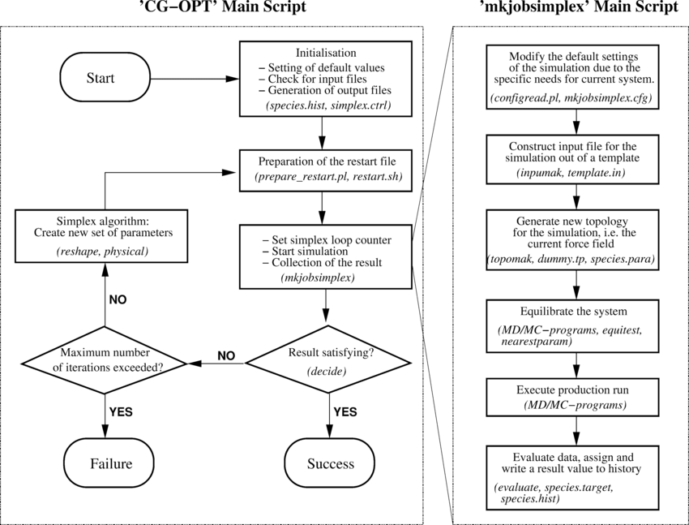

_mkjobsimplex is a subprogram of CG-OPT_

### Sub-programs within a multi-lingual program
Multiple language programs include modules that may be written in a variety of different languages. Language variance occurs because certain languages have strengths to perform certain tasks. 
* A common paradigm requiring multiple languages is *full stack development*, which is a web and/or mobile application that includes a client side front-end, a server side backend, and data management and through a database. It can also include the hardware, operating system, and networking required to launch the application.
* A full stack web developer will often need familiarity with server-side tools such as a server operating system, web server, database, and back-end programming *and* client-side tools such as websites and mobile apps.

ASIDE: Common server-side environments

| Application | Name | Cost |
| --- | --- | --- |
| __Microsoft Server__ |
| Operating System | Microsoft Server 2018 | $2050 |
| Web Server | Microsoft ASP.NET | FREE |
| Database | Microsoft SQL (MSSQL) | $899 |
| Server Language | Microsoft C# | FREE |
| __Linux Server (Traditional)__ | __LAMP__ |
| Operating System | Debian Server 8 | FREE|
| Web Server | Apache 2.0 | FREE |
| Database | mySQL | FREE |
| Language | PHP/Perl/Python | FREE |
| __Linux Server (Modern)__ | __LEMP__ |
| Operating System | Ubuntu Server LTS 22.04 | FREE |
| Web Server | NginX Web Server | FREE |
| Database | MariaDB/Postgres Databases | FREE |
| Language | PHP/Perl/Python | FREE |

## Control Systems (Topic 7 IB)
A **control system** is a device, or set of devices, that manages, commands, directs or regulates the behaviour of other devices or systems. A simplified definition is how computes automates tasks.
Some IB examples include: 
* automated doors
* heating systems
* taxi meters
* elevators
* washing machines
* process control
* device drivers
* GPS systems
* traffic lights

**Control Systems often use *sensors* for inputs, *microprocessors* to process data, and *actuators* or *motors* as outputs.**
* **Microprocessor**: an integrated circuit that contains all the functions of a central processing unit of a computer. It often also contains a small amount of memory (ROM or RAM) that stores the instructions. It can be thought of as a mini computer without the display that performs calculations.
* **Sensor**: a device which detects or measures a physical property and records, indicates, or otherwise responds to it. 
* **Motor**: A device which creates movement that is not measurable or fine tunable. Motors often run at a default rpm (revolutions per minute) and are either on or off. 
* __Actuator__: A device that creates movement that is specific. However, it is often less fast than a motor. An example of an actuator is one that can rotate up to 270 degrees. This actuator can receive degree specific instruction for rotation. 
* Motors and actuators are **transducers**, which are devices that convert digital signals to analogue signals and vice versa. 

### Sample

INPUTS
- sensor to observe the opposite traffic light
- push button to cross
- speed detection sensor
- camera to take pic of license plates 
- backup power
- infrared sensor 
- 

PROCESSING
- left turn arrow processing
- communication between the 4 traffic lights
- make the adjacent set of lights red if a pedestrian is crossing
- if a car speeds, send the license plate to a database
- 

OUTPUTS
- three lights colour change
- displaying pedestrian timers
- visual/audible cue for pedestrian to cross

//triangulation//

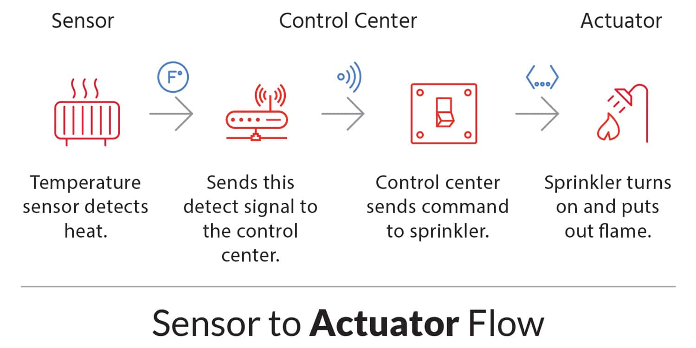

Control systems use **feedback loops** to regulate systems. Feedback is a *modification* or *control* of a process or system by the *results* or *effects* of the process. 

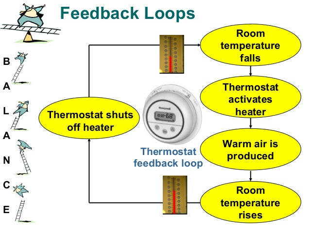

### Cross Curricular examples of Control Systems
#### Entropy (Science 30)
A thermodynamic quantity representing the degree of disorder or randomness in a system. A system at *Equilibrium* has the highest entropy. 
- Example: Adding ice cubes to a hot glass will spontaneously melt the ice, resulting in a homogenous lukewarm system (at thermal equilibrium)

#### Le Chatlier's Principle (Chemistry 30)
A principle stating that if a constraint (such as a pressure, temperature, or concentration of a reactant) is applied to a system in equilibrium, the equilibrium point will shift to counteract the effect of the changed constraint.

#### Homeostasis (Biology 20)
The tendency toward a relatively stable equilibrium between interdependent elements, especially to maintain physiological processes. 

## Central vs. Distributed Systems
*__Centralized Systems__ have a central location that houses majority of the computing hardware. Client terminals can interact with the centralized system through a network.*

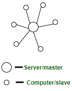

***Decentralized Systems** have computing hardware at various locations throughout the network. Client terminal connect to the nearest server, creating a computing node within the network. (Cryptocurrencies and certain online computer games use this model).*

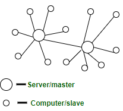

***Distributed systems** are networked computers that communicate and coordinate their actions with each other **without distinct computing hardware**. Instead, each computer within the network performs some computing operations and share the results with the rest of the network computers.*

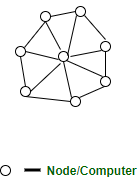

## Autonomous agents within Control Systems (IB)
**Autonomous Agents** are software entities that carry out some set of operations on behalf of a user or another program with some degree of independence (I.e. Roomba). Autonomous agents often possess characteristics of,
* **autonomy** - where agents can activate alone, select and complete tasks, and deactivate without human interaction (thermostat). 
* **reactive behaviour** - where agents can sense the environment and respond to the collected data. 
* **concurrency/sociality** - where agents can communicate with other agents to perform larger tasks (automotive factory). 
* **persistent** - where agents run continually and requires no human interaction to activate. 

## The CPU Components
The CPU is composed of several parts: *the control unit (CU), the arithmetic logic unit (ALU), memory address register (MAR), and the memory data register (MDR).*
* the CU operates the CPU. It contains the fast caching memory (L1 cache) and directs data to the ALU. 
* The ALU performs all arithmetic (+,-,*,/) and logical (AND/OR) calculations. There can be multiple ALU's within a CPU, each performing separate calculations (multi-core). 
* MAR is where the CU stores the address of the data it requires to load into the MDR. This data is often waiting in the RAM memory. 
* MDR is where the data is stored before being processed by the ALU.
* Once the data in the MDR is processed by the ALU, it is returned to the MDR, where the CU will use the MAR to return the data to the appropriate location in memory. 

All parts of the CPU are connected with printed wires called **busses**. The most important ones are the *data bus, control bus, and memory bus* for the MDR, CU, and MAR connection to the RAM. 

NOTE: CPUs also have I/O controllers that communicate with peripherals and secondary storage. 

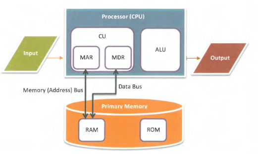

# testing new commit